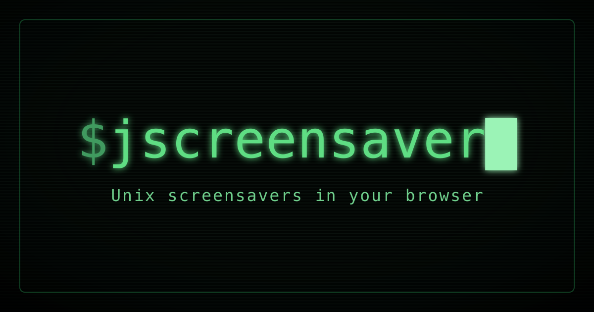

# JScreenSaver

**Unix screensavers in your browser — live at [jscreensaver.net](https://jscreensaver.net/)**

JavaScript port of generative artwork from [XScreenSaver](https://www.jwz.org/xscreensaver/). 170+ Unix/X11 screenhacks reimplemented from the original C and OpenGL. Minimalist full-viewport UI with keyboard navigation and mobile support.
